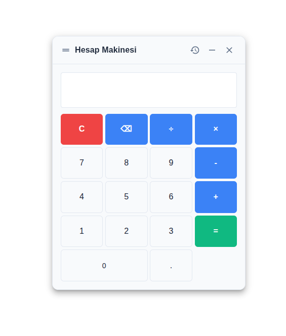

# @salihoz0/react-calculator

Modern, minimalist React calculator component with a clean, professional design (MUI-based).

## Features

✨ **Minimalist Design** - Clean white background with subtle borders and soft shadows
🎨 **Customizable Title** - Set your own calculator title (default: "Calculator")
📜 **Calculation History** - View and reuse previous calculations
💾 **LocalStorage Persistence** - Remembers position and minimized state
🖱️ **Draggable** - Move the calculator anywhere on screen (floating mode) with intuitive drag handle
⌨️ **Keyboard Support** - Full keyboard input including Esc (clear), Backspace, Enter
🔢 **Enhanced Buttons** - C (clear), ⌫ (backspace), and color-coded operators
🎯 **Three Display Modes** - Embedded, Modal, or Floating

## Demo



## Installation

```bash
npm install @salihoz0/react-calculator
```

### Peer Dependencies

This component requires the following peer dependencies:

```bash
npm install react react-dom @mui/material @emotion/react @emotion/styled @mui/icons-material
```

## Usage Examples

### Basic Embedded Calculator

```jsx
import React from 'react';
import Calculator from '@salihoz0/react-calculator';

function App() {
  return (
    <div>
      <h1>My App</h1>
      <Calculator mode="embedded" />
    </div>
  );
}
```

### Calculator with Change Handler

```jsx
import React, { useState } from 'react';
import Calculator from '@salihoz0/react-calculator';

function App() {
  const [result, setResult] = useState('');

  return (
    <div>
      <Calculator
        mode="embedded"
        title="My Calculator"
        onChange={(value) => setResult(value)}
      />
      <p>Current value: {result}</p>
    </div>
  );
}
```

### Modal Calculator

```jsx
import React, { useState } from 'react';
import Calculator from '@salihoz0/react-calculator';

function App() {
  const [isOpen, setIsOpen] = useState(false);

  return (
    <div>
      <button onClick={() => setIsOpen(true)}>Open Calculator</button>
      <Calculator
        mode="modal"
        title="Calculator Modal"
        initiallyOpen={isOpen}
        onClose={() => setIsOpen(false)}
        onChange={(value) => console.log('Result:', value)}
      />
    </div>
  );
}
```

### Floating Calculator with External Control

```jsx
import React, { useState } from 'react';
import Calculator from '@salihoz0/react-calculator';

function App() {
  const [isOpen, setIsOpen] = useState(false);

  return (
    <div>
      <button onClick={() => setIsOpen(!isOpen)}>
        {isOpen ? 'Close' : 'Open'} Calculator
      </button>
      <Calculator
        mode="floating"
        title="Floating Calculator"
        initiallyOpen={isOpen}
        setOpen={setIsOpen}
        width={400}
        height={550}
      />
    </div>
  );
}
```

### Customized Styling

```jsx
import React from 'react';
import Calculator from '@salihoz0/react-calculator';

function App() {
  return (
    <Calculator
      mode="embedded"
      title="Custom Calculator"
      styleOverrides={{
        paper: { borderRadius: 2, boxShadow: 3 },
        button: { borderRadius: 1 },
        buttonByKey: {
          '=': { bgcolor: 'success.main', '&:hover': { bgcolor: 'success.dark' } },
          'C': { bgcolor: 'error.main', '&:hover': { bgcolor: 'error.dark' } }
        },
        display: { fontSize: '1.2rem' }
      }}
    />
  );
}
```

## Props API

| Prop | Type | Default | Required | Description |
|------|------|---------|----------|-------------|
| `mode` | `'embedded' \| 'modal' \| 'floating'` | `'embedded'` | No | Display mode of the calculator |
| `title` | `string` | `'Calculator'` | No | Title shown in the calculator header |
| `historyTitle` | `string` | `'Calculation History'` | No | Title for the history panel |
| `initiallyOpen` | `boolean` | `false` | No | Initial open state (only for modal/floating modes) |
| `initialValue` | `string \| number` | `''` | No | Initial value displayed in the calculator |
| `onChange` | `(value: string) => void` | `undefined` | No | Callback fired when the display value changes |
| `onOpen` | `() => void` | `undefined` | No | Callback fired when calculator opens |
| `onClose` | `() => void` | `undefined` | No | Callback fired when calculator closes |
| `setOpen` | `(open: boolean) => void` | `undefined` | No | External state setter for open/close (alternative to internal state) |
| `width` | `number` | `380` | No | Width of the calculator in pixels |
| `height` | `number` | `500` | No | Height of the calculator in pixels |
| `styleOverrides` | `object` | `{}` | No | MUI sx prop overrides for customizing appearance |

### Style Overrides

The `styleOverrides` prop allows deep customization of the calculator's appearance. You can pass either:

1. **Flat object**: Applies styles to the root Paper component
2. **Nested object**: Target specific parts of the calculator

```jsx
// Flat style (applies to root Paper)
styleOverrides={{
  bgcolor: 'lightblue',
  border: '2px solid blue'
}}

// Nested styles
styleOverrides={{
  paper: { /* Root Paper styles */ },
  titleBar: { /* Title bar Box styles */ },
  button: { /* General button styles */ },
  buttonByKey: { /* Specific button styles by key */ },
  display: { /* TextField display styles */ },
  history: { /* History list container styles */ },
  historyTitle: { /* History title Typography styles */ },
  modal: { /* Modal inner Box styles (modal mode only) */ }
}}
```

## Features in Detail

### Calculation History
- Click the history icon to view past calculations
- Click any history entry to load the expression back into the display
- History is persisted in localStorage (last 20 calculations)
- Displays expression and result for each calculation

### Minimize/Maximize Behavior
- **Minimize** (− icon): Hides calculator UI but saves current state (display + history) to localStorage
- **Close** (× icon): Closes calculator and clears minimized state
- When reopened after minimize, restores last display value and history
- Position is always remembered in localStorage

### Keyboard Shortcuts
- `0-9`, `.`, `+`, `-`, `*`, `/` - Input numbers and operators
- `Enter` or `=` - Evaluate expression
- `Backspace` - Delete last character
- `Escape` or `C` - Clear display

### Button Layout
- **C** (red) - Clear all
- **⌫** (blue) - Backspace/delete last char
- **÷ × − +** (blue) - Operators
- **=** (green) - Evaluate
- **0-9 .** (gray) - Numbers and decimal

## Development

To test changes locally before publishing:

```bash
# In react-calculator directory
npm link

# In your test app directory
npm link @salihoz0/react-calculator
```

## Notes
- Calculation history and position are stored in browser localStorage
- Minimized state is cleared when calculator is explicitly closed (× button)
- The calculator uses `Function()` for expression evaluation (basic arithmetic only)
- For production use, consider a proper math parser library for enhanced security
- Component is built with Material-UI v5 and requires React 17+
- `0-9`, `.`, `+`, `-`, `*`, `/` - Input
- `Enter` or `=` - Evaluate expression
- `Backspace` - Delete last character
- `Escape` or `C` - Clear display

### Button Layout
- **C** (red) - Clear all
- **⌫** (blue) - Backspace/delete last char
- **÷ × − +** (blue) - Operators
- **=** (green) - Evaluate
- **0-9 .** (gray) - Numbers and decimal

## Development

To test changes locally before publishing:

```pwsh
# In react-calculator directory
npm link

# In your app directory
npm link react-calculator
```